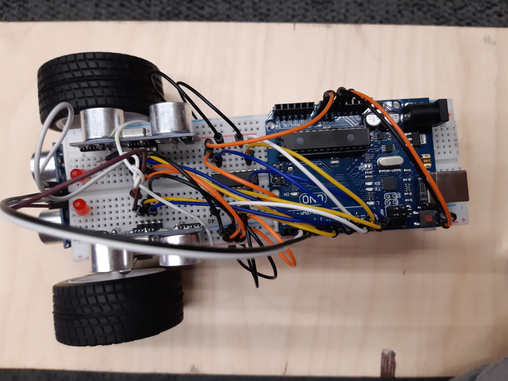

# Robot Building Competition 2023

Organised by SMEE - Society of Monash Electrical Engineers

2 day event where teams of four people got together to build and program a robot to navigate out of a maze. 

Components used included:
- Arduino Uno
- L293D H bridge motor drivers
- HC-SR04 Ultrasonic distance sensors
- HM10 Bluetooth modules (not shown in images)
- TCS3200 Colour sensor (not shown in images)

